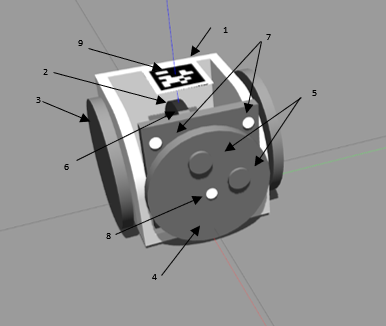

# MSRR2
#### A simple simulation for a two wheeled differential robot that has the ability to attach with other similar robots and can take many forms each with different functionalities.

### To get started to you need to do the following:
The codes are distributed between two ros workspaces which are catkin_ws2_final and catkin_ws2_final using Python2 and Python3 respectively

after downloading the workspaces you need to make the catkin_ws2_final using the command: **catkin_make_isolated**

You need to make catkin_ws3_final using the command: **catkin_make -DPYTHON_EXECUTABLE=/usr/bin/python3**

other essential commands to set up everything correctly and in order to build everything successfully:

  sudo sh -c 'echo "deb http://packages.osrfoundation.org/gazebo/ubuntu-stable `lsb_release -cs` main" > /etc/apt/sources.list.d/gazebo-stable.list'
  
  wget https://packages.osrfoundation.org/gazebo.key -O - | sudo apt-key add -
  
  sudo apt-get update
  
  sudo apt-get install gazebo9
  
  sudo apt-get install libgazebo9-dev
  
  /usr/bin/python3 -m pip install -U PyQt5 --user
  
  /usr/bin/python3 -m pip install -U PyQtDataVisualization --user
  
  /usr/bin/python3 -m pip install -U PyQtWebEngine --user
  
  /usr/bin/python3 -m pip install -U PyQtChart --user
  
  /usr/bin/python3 -m pip install -U PyQt5-stubs --user
  
  /usr/bin/python3 -m pip install -U Numpy --user
  
Please visit our webpage at https://blablabla15851.wixsite.com/msrr

1)	The main body of the robot
2)	The tilting mechanism
3)	The wheels
4)	Front face
5)	Front face magnets (South – North)
6)	The rotating mechanism
7)	ToF sensors
8)	IR sensors
9)	Apriltag (ID: 0)
